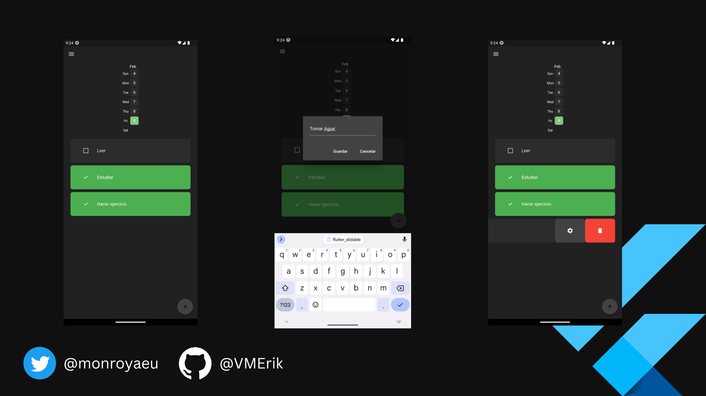

# Habit_Tracker_App

Este proyeto permite llevar el seguimiento de habitos en un Heat Map.
En donde dependiendo la cantidad de habitos cumplido por cada uno de los dias, la intensidad de color que veremos en nuestro Heat Map sera mayor.

## Caracteristicas
En este proyecto hacemos uso de  las siguientes caracteristicas.
- isar : Para almacenamiento local en el dispositivo

- flutter_heatmap_calendar : Para la visualizacion del comportamiento de nuestros habitos.

- Provider : Para el manejo de estados, tanto para la comunicacion de la base de dato, como para el uso de cambio de tema de nuestro proyecto. 

- flutter_slidable : Para la interaccion con los habitos en los features de actualizar y eliminar

## Vista Previa
